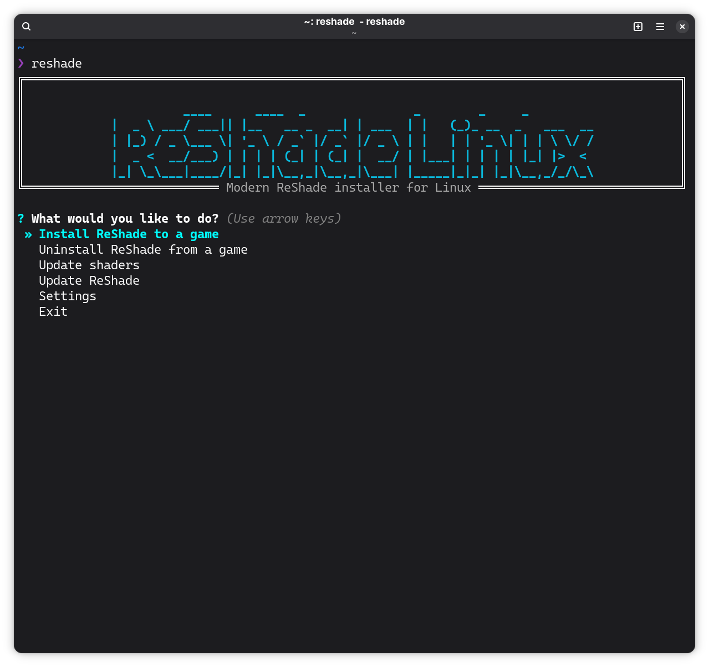

# ReShade Linux

A revamped CLI tool for installing [ReShade](https://reshade.me) on Linux for Steam games running via Wine/Proton, comfortably.



## Features

- **Automatic game detection** - Scans Steam libraries for installed games
- **PE analysis** - Detects executable architecture (32/64-bit) and graphics API (DX9/10/11/12/OpenGL)
- **Per-game configuration** - Saves settings so you don't re-enter paths
- **Shader management** - Downloads and merges popular shader repositories
- **One-command install** - Single script sets up everything

## Requirements

- Python 3.10+
- `git` - For cloning shader repositories
- `7z` (p7zip) - For extracting ReShade

**Arch/Manjaro:**
```bash
sudo pacman -S python git p7zip
```

**Ubuntu/Debian:**
```bash
sudo apt install python3 python3-venv git p7zip-full
```

**Fedora:**
```bash
sudo dnf install python3 git p7zip
```

## Installation

```bash
git clone https://github.com/nesdeq/reshade.git
cd reshade
./install.sh
```

This installs to `~/.local/reshade` and creates the `reshade` command.

## Usage

```bash
reshade
```

### Steam Launch Options

After installing ReShade to a game, add this to Steam launch options:

```
WINEDLLOVERRIDES="d3dcompiler_47=n;dxgi=n,b" %command%
```

Replace `dxgi` with the DLL shown after installation (e.g., `d3d9` for DX9 games).

## Directory Structure

```
~/.local/reshade/
├── .venv/              # Python virtual environment
├── reshade/            # ReShade binaries
├── ReShade_shaders/    # Shader repositories
│   └── Merged/         # Combined shaders (auto-configured in ReShade)
├── External_shaders/   # Your custom shaders (add .fx files here)
├── games.json          # Saved game configurations
└── ReShade.ini         # Global ReShade config
```

## Adding Custom Shaders

Drop `.fx` files into `~/.local/reshade/External_shaders/` and run `reshade` → "Update shaders" to merge them.

## Included Shader Repositories

- [reshade-shaders](https://github.com/crosire/reshade-shaders) (slim branch)
- [SweetFX](https://github.com/CeeJayDK/SweetFX)
- [qUINT](https://github.com/martymcmodding/qUINT)
- [AstrayFX](https://github.com/BlueSkyDefender/AstrayFX)
- [prod80](https://github.com/prod80/prod80-ReShade-Repository)

## Uninstall

```bash
# Remove from a game first via the tool, then:
rm -rf ~/.local/reshade ~/.local/bin/reshade
```

## License

GPL-2.0 - Based on [reshade-steam-proton](https://github.com/kevinlekiller/reshade-steam-proton) by kevinlekiller.
