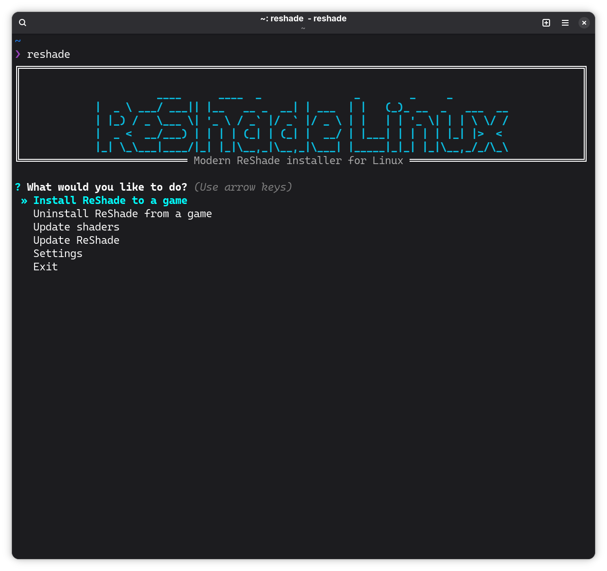

# ReShade for Linux — one-line installer for Steam (Proton) and Wine

Install [ReShade](https://reshade.me) on Linux in one line. No sudo, no Wine tweaks, no Windows VM. Works with Steam + Proton and any Wine prefix. Detects the game's graphics API (DX9 / DX10 / DX11 / DX12 / OpenGL) automatically and links the right DLL.



## Install

```bash
curl -fsSL https://raw.githubusercontent.com/nesdeq/reshade/main/install.sh | bash
```

Installs to `~/.local/reshade` and drops a `reshade` command in `~/.local/bin`. **No root.** If `~/.local/bin` isn't on your `PATH`, the installer prints the exact line to add.

## Run

```bash
reshade
```

1. Pick a Steam game (or **Browse manually** for non-Steam Wine games).
2. The installer detects the API and links the correct DLL override.
3. Copy the shown `WINEDLLOVERRIDES=...` line into **Steam → Properties → Launch Options**.
4. Launch the game, press **Home** to open the ReShade overlay.

## Custom shaders

Drop `.fx` / `.fxh` / textures into `~/.local/reshade/External_shaders/`, then pick **Update shaders** from the menu.

## Uninstall

Run `reshade` → **Uninstall** (only shows games this tool installed to).

Remove the tool itself:

```bash
rm -rf ~/.local/reshade ~/.local/bin/reshade
```

## Requirements

`python3` (3.10+) · `git` · `curl` · `7z`

| Distro | Install deps |
|---|---|
| Arch / Manjaro / CachyOS / EndeavourOS | `sudo pacman -S python git curl p7zip` |
| Ubuntu / Debian / Pop!_OS / Mint | `sudo apt install python3 python3-venv git curl p7zip-full` |
| Fedora / Nobara / Bazzite | `sudo dnf install python3 git curl p7zip` |
| openSUSE | `sudo zypper install python3 git curl p7zip` |

## FAQ

### Does ReShade work on Linux with Proton?
Yes — that's the primary target. Any Steam game running under Proton (stock, GE, Experimental) works once you set the `WINEDLLOVERRIDES` launch option the installer shows you.

### Does it work without Steam (plain Wine, Lutris, Heroic, Bottles)?
Yes. Choose **Browse manually** and point it at the game folder inside the Wine prefix. Set `WINEDLLOVERRIDES` in your launcher's environment instead of Steam launch options.

### Do I need root or sudo?
No. Everything lives in `~/.local/`. Only the one-time system dependencies (`python`, `git`, `curl`, `7z`) need your package manager.

### Which distros are supported?
Any modern Linux with Python 3.10+ — Arch, CachyOS, Ubuntu, Debian, Fedora, Nobara, Bazzite, openSUSE, SteamOS, Pop!_OS. SteamOS's read-only root is fine — the tool only writes to `~/.local` and your Steam library.

### Which graphics APIs are supported?
DirectX 8, 9, 10, 11, 12, and OpenGL. Vulkan needs a different ReShade setup that isn't handled here.

### How do I open the ReShade overlay in-game?
Press **Home**. Rebind in `~/.local/reshade/ReShade.ini` under `[INPUT]`.

### Does ReShade trigger anti-cheat on Linux?
ReShade injects a DLL into the game process. Kernel-mode anti-cheats (EAC, BattlEye, Vanguard) will ban you. Use it on single-player and offline games only.

### Will this break my game or overwrite files?
No. All files are symlinks. Uninstall restores the original state. Save files are never touched.

### How do I update ReShade or shaders later?
Run `reshade` → **Update ReShade** or **Update shaders**.

### Where are the shaders stored?
`~/.local/reshade/ReShade_shaders/`. Merged into `Merged/` and symlinked into each game directory — so editing a shader once updates every game.

## Included shader repositories

[reshade-shaders](https://github.com/crosire/reshade-shaders) (slim) · [SweetFX](https://github.com/CeeJayDK/SweetFX) · [qUINT](https://github.com/martymcmodding/qUINT) · [AstrayFX](https://github.com/BlueSkyDefender/AstrayFX) · [prod80](https://github.com/prod80/prod80-ReShade-Repository)

## Credits

Based on [reshade-steam-proton](https://github.com/kevinlekiller/reshade-steam-proton) by kevinlekiller. Rewritten with a modern TUI, PE-based API detection, per-game config, and a one-line installer.

## License

GPL-2.0
